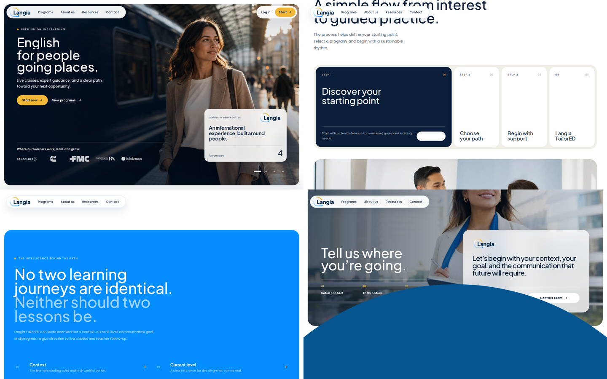
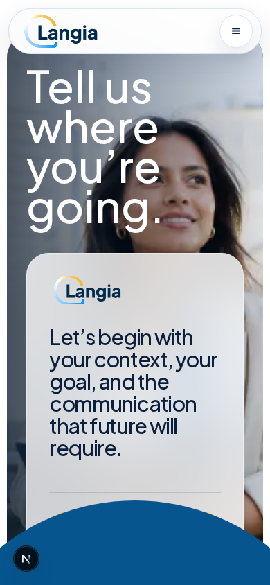
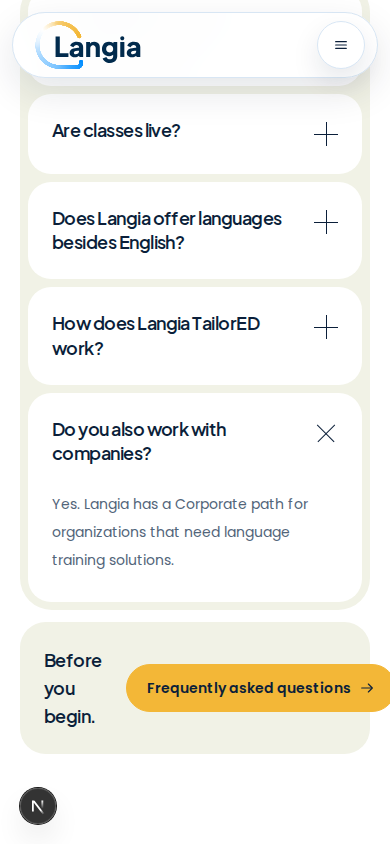

**Langia homepage — final design audit, 5 September 2026**

Application source was not modified. This audit reviews the current uncommitted implementation, repository content/history, and the Kora recording. Implementation remains pending the user's answers.

**Evidence and limits**

- Kora: `references/Page inspiration.mp4`, 81.28 seconds, 1918×946. Extracted and reviewed sequential frames at 0.5-second intervals. [Reference notes](../.visual/langia/final-review/audit-baseline/reference/reference-audit.md).
- Only the Kora recording was found. The current Langia recording mentioned in the brief is absent from the searched workspace, attachment directories and home/temp locations. Comparison against that second recording remains pending.
- The existing preview on port 3000 served HTML but did not hydrate: hero buttons and scroll listeners did not activate, with HMR websocket errors. Rechecked the identical source from an isolated copy at `/tmp/langia-audit-preview`, running webpack development mode on port 4173. This restored hydration and allowed actual interaction testing. These environment failures are not counted as source-level dead controls.
- Browser inspection at 1918×946, 1440×900, 1280×800, 768×1024, 390×844 and 360×740. Primary interaction tests use 1440×900 and true touch/mobile 390×844 contexts.
- No horizontal document overflow at those widths. This does not mean every control fits: clipping hides the mobile FAQ overflow, and the footer overlaps mobile conversion actions.
- One legacy capture script caused its own hydration attribute warning by changing the document's scroll style before hydration. Clean state tests did not produce application console/page errors. Do not report the injected warning as a homepage defect.
- No login credentials entered, accounts created, messages sent, or production configuration changed. Real login screen reached; completed authentication and delivery of contact requests remain unverified.
- Screenshots with pending images were rejected for visual conclusions. Focused captures wait for visible images to load. Older unhydrated captures are excluded from final motion conclusions.

**Captured journey and health**

| Step | Current scene | Health and action |
|---|---|---|
| 1 | Hero and navigation | Strong cinematic source and editorial composition. Heavy gradients plus scroll darkening make it gloomy. Automatic photo/name cycling competes with ordered scroll choreography. Nav dropdown has a hover gap and inaccessible hidden actions. |
| 2 | Transformation | One useful contrast, but title repeats after the hero sheet and the comparison spends 350svh on two cards. Regular desktop loses the human motivation copy shown on mobile. |
| 3 | Programs | Preserve the generous text/photo compositions and stacking concept. Four learner offerings have distinct existing destinations. Full fifth Corporate card contradicts 'four ways' introduction and duplicates the later company feature. |
| 4 | How it works / method | Expanding interaction works via hover/focus/click and mobile tap, with no stationary autoplay. Starts on fourth panel rather than first. Active CTA labels are white on white; step button accessible names omit titles. Method photograph, following headline and benefits repeat the same proposition. |
| 5 | Personalization | Oversized Signal Blue field, low-contrast text, decorative '+' rows and another large navy panel. Same TailorED proposition explained again. Merge unique content into a lighter method explanation. |
| 6 | Global presence / credibility | Learner-workplace logos are useful with correct attribution. Corporate photograph repeats for the third time across the page. Generated imagery is contextual brand photography, not proof of actual learners or customer relationships. |
| 7 | Metrics | Four languages, four learner programs, founding year 2020 and one corporate route are content-backed company facts. First three repeat in credibility tiles; first also appears in hero. Keep a single concise presentation. |
| 8 | Corporate | Same title/body/photo/destination as fifth program; two additional same-label CTAs inside this scene. Reserve one distinct organizational proposition if corporate prominence is approved. |
| 9 | FAQ | Five disclosure controls work with click, Enter and mobile tap. Bottom action is wrongly labeled 'Frequently asked questions' yet opens Contact; long label clips at mobile right edge. |
| 10 | Resources | Published article destinations exist. Reuses method photography for AI article. All article bodies are English; ES/PT page chrome does not translate the articles. Place before FAQ to improve the approach to conversion. |
| 11 | Photographic finale | Keep the photograph and translucent white interface. Both actions currently go to Contact; primary has duplicate arrows. Excessive desktop sticky hold. On mobile the footer circle physically blocks both CTA taps. |
| 12 | Footer | Mist canvas and giant wordmark are a strong ending. Remove circle and artificial rise/scale. Navigation and locale controls have real destinations/states, but several text targets need spacing improvements. No social links are configured. |

**Selected captured evidence**

**Confirmed duplication and content recovery**

- Exact 'More than classes: a path built to move with you.' headline appears on the method photograph and immediately afterward above benefits. TailorED body also appears in appended process step four. Merge the photo, benefits and unique personalization details intelligently.
- 'Languages for teams crossing borders.' appears as a full program scene and a later corporate scene with identical copy and image. The same image also fills Global Presence: three uses.
- First five workplace logos and 'Where our learners work, lead, and grow.' occur in the hero; all eight logos and same line return in Global Presence. Preserve one attribution: learner/alumni workplaces, not partners or corporate customers.
- Metrics appear in hero, interactive credibility rail and separate metrics section. The interactive rail changes emphasis but reveals no new facts.
- Hero's white sheet and transformation repeat the opening statement. The continuity is understandable but currently creates a second reading beat.
- 'Everyone learns for a different reason.', its supporting body and five motivations remain in content and render on mobile/reduced-motion, but are absent from normal desktop. Restore them within the consolidated brand scene.
- No approved learner testimonials, real learner portraits or learner outcome dataset was found. Earlier named quotes were documented as temporary/unverified. Never restore them as evidence. Company facts have repository provenance; that is not independent business validation.
- Newsletter omission was intentional: the historical field had no working backend. The third article remains in Blog. These are not accidentally lost working features.

**Clear fixes to implement after answers; no separate permission needed**

1. Remove footer circle and overlap that intercept mobile finale taps. Remove artificial footer translation/scaling and shorten the finale's unproductive sticky hold.
2. Correct process CTA foreground color: white text currently inherits onto a white button. Remove duplicate arrow icons in finale/corporate CTAs. Normalize Gold primary, White/Mist secondary, and text actions.
3. Remove false expand affordances from personalization rows. Present the information as readable content unless a real additional state exists; current rows have none.
4. Replace credibility's expanding +/- facts with a single quiet factual presentation.
5. Repair nav dropdown hover continuity, Escape behavior, hidden Login/Start focus stops, and mobile menu focus escaping behind its overlay. Preserve confirmed login destination.
6. Exclude collapsed mobile process links from keyboard focus; name desktop step controls with their titles and maintain valid expanded/control relationships.
7. Fix mobile FAQ CTA label and wrapping. Verify both finale buttons stay reachable at all widths.
8. Lighten hero overlay locally, active method panels, benefits and personalization. Replace cream/olive-tinted surfaces copied from Kora with Langia White/Mist where appropriate. Personalization contrast tests report 2.1–3.32:1 for affected text; active process CTA contrast is 1:1.
9. Correct mobile portrait crops/resolution: desktop landscape hero image is visibly soft and text crosses the face. Preserve human subjects and actual image quality.
10. Restore desktop human motivation content; reconcile four learner programs versus the appended corporate fifth entry.
11. Remove redundant headings, imagery, CTA duplicates and unnecessary transition space while keeping useful content and generous scene spacing.

**Motion judgment**

Kora's 0–19-second sequence keeps one image while foreground exits, media expands/defocuses, then white page takes over. Preserve this order, shorten Langia's low-information holds, and resolve photo rotation before implementation. At 1440×900, hero and transformation alone occupy 6,588 pixels before Programs; the full page is 24,508 pixels. At 390×844 it is 25,512 pixels, roughly 30 viewport heights. These are editing signals, not exact length targets.

Kora's process changes 04→03→02→01 as the cursor moves at roughly 37–39 seconds. Langia's current implementation already uses direct hover/focus/click and tap. It has no sticky process headline and no autoplay; do not fix an imagined timer. Normal scrolling can carry the process heading under the fixed nav, but no sticky-headline collision was reproduced. Preserve direct control, begin at the first meaningful step, and address clipping, labels and contrast.

Remove proof-tile resizing that communicates no new data and decorative hover-to-pill personalization transformations. Reduce repeated image zoom/reveal effects where they do not explain state or continuity. No configured method video was found; the current method scene is a photograph. If a video is later supplied, playback needs a purposeful, user-controlled treatment.

Kora does contain a mint footer arc around 74 seconds. Langia's circle should still be removed as explicitly requested: it adds unwanted visual weight and blocks mobile conversion, regardless of the reference motif.

**Provisional final architecture**

1. Hero — aspiration and first action.
2. Brand/transformation — why learning matters, including recovered human motivations.
3. Programs — four learner paths; brief company signpost if approved.
4. How it works — practical onboarding steps with deterministic expanding panels.
5. TailorED — one method scene combining photograph, benefits and concise light personalization explanation.
6. Credibility — one workplace-logo strip and one concise fact row; real learner proof only if approved material exists.
7. Companies — one distinct organizational feature, if approved.
8. Resources — useful next reading.
9. FAQ — resolve objections.
10. Photographic final CTA — confirmed individual/company or sales/enrollment behavior.
11. Mist footer — navigation, language and oversized wordmark.

This is a proposal, not an implemented structural decision. Subjective choices remain pending.

Reduced-motion inspection at 1280×800 confirmed that the hero becomes a 900px normal-flow scene and transformation becomes 1,045px. The final CTA still occupies 1,600px with sticky positioning; simplify that hold as part of the footer/finale repair. No video element was rendered.

Detailed source/history evidence: [content-routes.md](../.visual/langia/final-review/audit-baseline/content-routes.md). Interaction evidence: [states-report.json](../.visual/langia/final-review/audit-baseline/interactions/states-report.json), [mobile-blockers-report.json](../.visual/langia/final-review/audit-baseline/interactions/mobile-blockers-report.json). Viewport geometry: [responsive.json](../.visual/langia/final-review/audit-baseline/verified-responsive/responsive.json). Confirmed finale hit tests: [report.json](../.visual/langia/final-review/audit-baseline/focused/report.json).

Full readable interaction inventory and findings: [interaction-audit.md](../.visual/langia/final-review/audit-baseline/interactions/interaction-audit.md). Per-anchor results: [links-report.json](../.visual/langia/final-review/audit-baseline/interactions/links-report.json).
